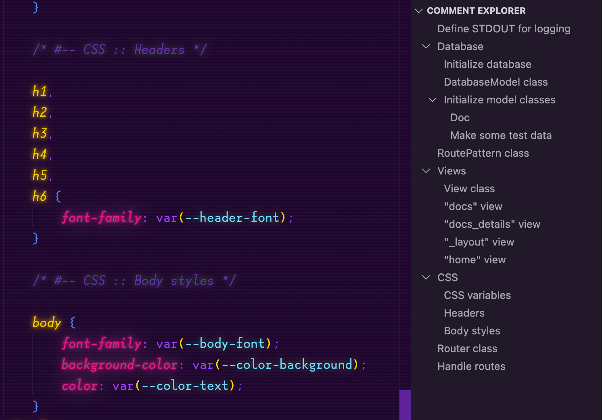

# comment-explorer

Every wanted to make a web application in a **_single PHP file?_**

Finding things in big files is a chore.

No longer!



## Features

- Write special comments that begin with the "`#--`" prefix.
- You can use "`::`" to nest sections.

## Known Issues

> At the moment it expects a section to be a container or a destination but not both.

For example if you have:

```js
/* #-- Main Controller */

/* #-- Main Controller :: Update */
```

It will create both "`Main Controller`" and "`> Main Controller`" in your sidebar.

## Release Notes

### 1.0.0

Initial release
